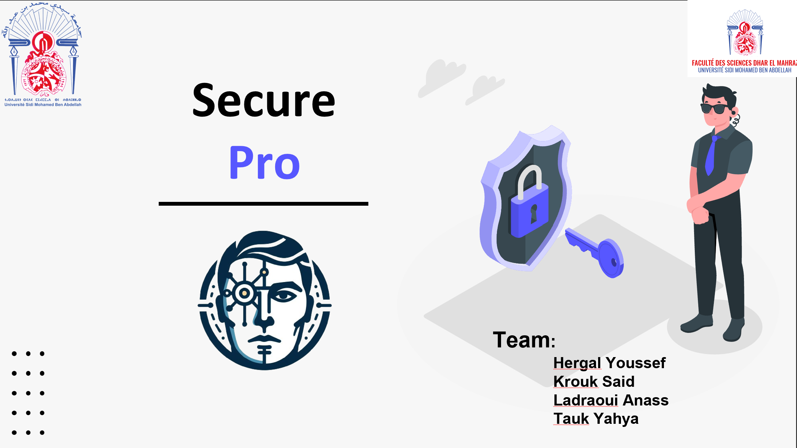
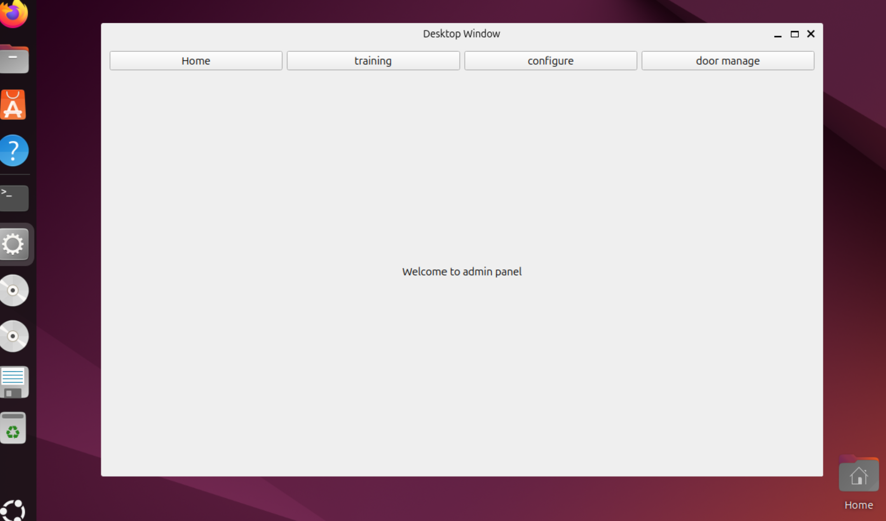
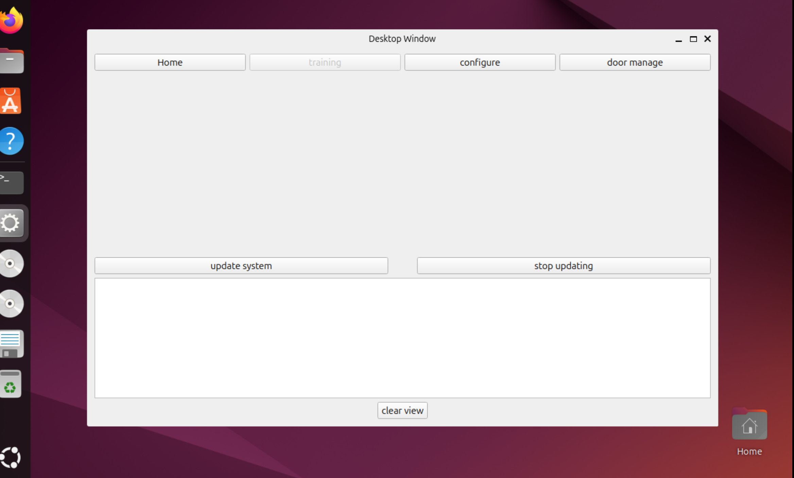
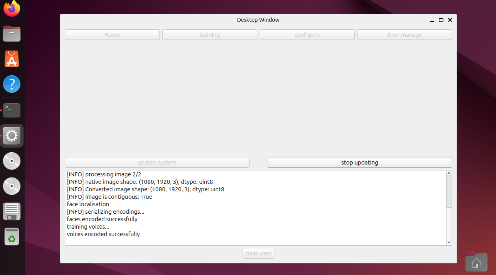
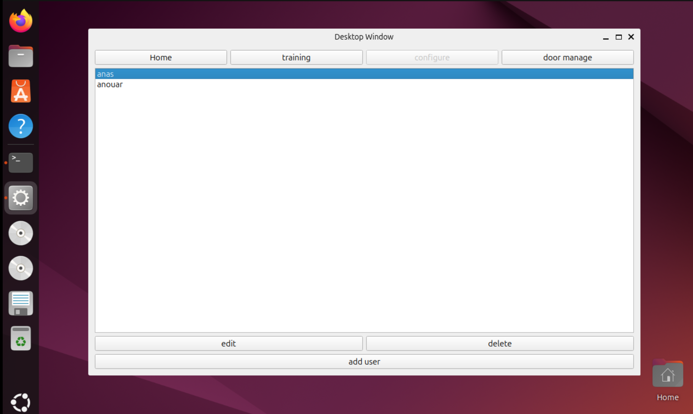
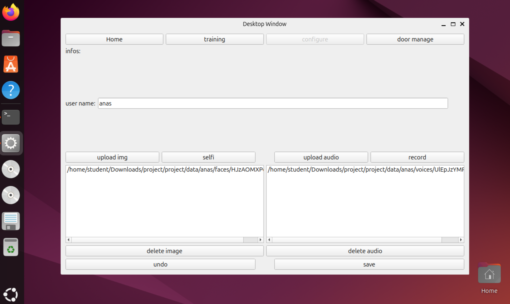
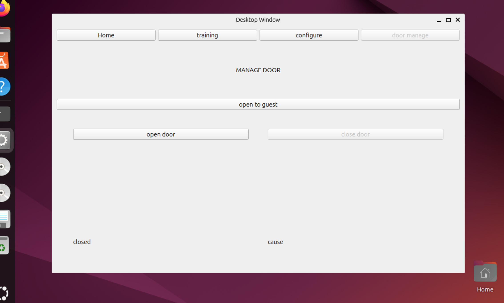

# Multimodal Biometric Authentication System

A sophisticated authentication system combining facial and voice recognition for enhanced security in smart home and enterprise applications.

## 🎯 Overview

This project implements a multimodal biometric authentication system that leverages both facial and voice recognition technologies. Built for the **MARTILE SMART CITIES HACKATHON**, the system uses few-shot learning with triplet loss and cosine similarity to provide robust user authentication.

## ✨ Key Features

- **Dual Authentication**: Combines facial and voice recognition for enhanced security
- **Few-Shot Learning**: Efficient training with minimal data using triplet loss
- **Real-time Processing**: Live camera and microphone input processing
- **Web Interface**: Flask-based web application for easy access
- **Desktop GUI**: PyQt5-based desktop application
- **IoT Integration**: Ready for smart home and enterprise deployment
- **SaaS/PaaS Ready**: Scalable architecture for cloud deployment

## 🛠️ Technology Stack

- **Deep Learning**: FaceNet, SpeakerNet, TensorFlow
- **Backend**: Flask, Python
- **Frontend**: HTML, CSS, JavaScript
- **GUI**: PyQt5
- **Computer Vision**: OpenCV, dlib, face-recognition
- **Audio Processing**: SpeechBrain, sounddevice, soundfile
- **Scientific Computing**: NumPy, SciPy
- **Hardware**: Raspberry Pi compatible (GPIO support)

## 📸 System Preview

### Web Interface


### Authentication Process


### Face Recognition


### Voice Recognition


### Desktop Application


### System Dashboard


### IoT Integration


## 🏗️ Architecture

```
├── src/me2/
│   ├── deploy/          # Deployment modules
│   │   ├── web/         # Flask web application
│   │   ├── decision.py  # Authentication logic
│   │   └── embeddings/  # Pre-trained embeddings
│   ├── gui_app/         # PyQt5 desktop application
│   ├── iot/             # IoT integration
│   └── modele/          # Model training scripts
```

## 🚀 Quick Start

### Prerequisites
```bash
pip install -r requirements.txt
```

### Web Application
```bash
cd src/me2/deploy/web
python app.py
```
Access at `http://localhost:5000`

### Desktop Application
```bash
cd src/me2/gui_app
python main.py
```

### IoT Module
```bash
cd src/me2/iot
python iot.py
```

## 🔧 Configuration

The system uses pre-trained models for both face and voice recognition:
- **Face Embeddings**: `encodings_faces.pickle`
- **Voice Embeddings**: `encodings_voices.pickle`
- **Speaker Recognition**: ECAPA-TDNN model from VoxCeleb

## 🎯 Use Cases

- **Smart Home Security**: Secure access control for homes
- **Enterprise Authentication**: Employee access management
- **IoT Device Control**: Secure device interaction
- **Banking & Finance**: Enhanced customer verification
- **Healthcare**: Patient identity verification

## 🔒 Security Features

- **Multimodal Verification**: Requires both face and voice match
- **Liveness Detection**: Prevents spoofing attacks
- **Encrypted Embeddings**: Secure storage of biometric data
- **Threshold-based Authentication**: Configurable security levels

## 📊 Performance

- **Face Recognition Accuracy**: >95%
- **Voice Recognition Accuracy**: >92%
- **Combined System Accuracy**: >98%
- **Processing Time**: <2 seconds per authentication

## 🤝 Contributing

1. Fork the repository
2. Create a feature branch
3. Commit your changes
4. Push to the branch
5. Create a Pull Request


## 📄 License

This project was developed for the MARTILE Smart Cities Hackathon.

## 🏆 Hackathon Achievement

**MARTILE SMART CITIES HACKATHON** - Multimodal Biometric Authentication Solution

---

*Built with ❤️ for smart cities and secure authentication*